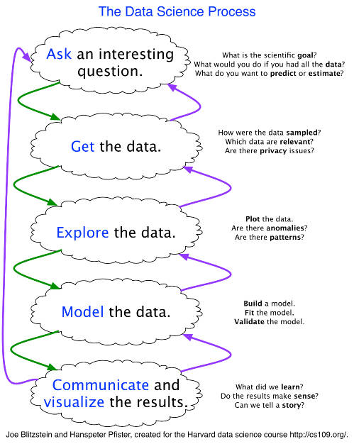

```{r setup, include=FALSE}
knitr::opts_chunk$set(echo = FALSE)
```


## What is Data Science?

One [answer](http://bulletin.imstat.org/2014/10/ims-presidential-address-let-us-own-data-science/) from former Institute of Mathematical Statistics president Bin Yu


## What is Data Science?

Another view from Drew Conway


## 



## Data Science Project


Source: *R for Data Science*, Grolemund and Wickham

## Advice for this course

- You are going to get frustrated, you're learning a new language
    + "You actually don't know what you are doing until after you have done it."
    
- Look at your data

- Don't be stuck for more than 20 minutes. This takes self-awareness and mindfulness.  Think of the marginal return of your efforts.

- Do the most braindead thing first, take it end to end, then iterate/improve.

# [cmsc205.github.io](https://cmsc205.github.io/index.html)

# R and R Studio

## RStudio

### On the server

- Go to http://rstudio.lawrence.edu/
- Log in using your LU credentials
- Note: Rstudio server can only be accessed on campus

### On your machine

- Follow the [instructions](https://cmsc205.github.io/week01.html) on the website to install

# Demo