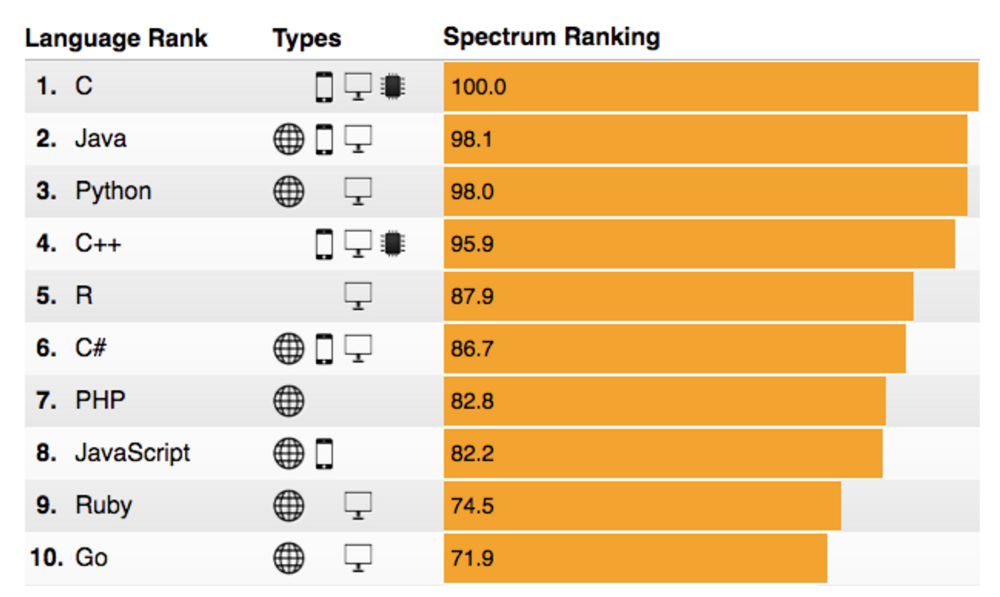
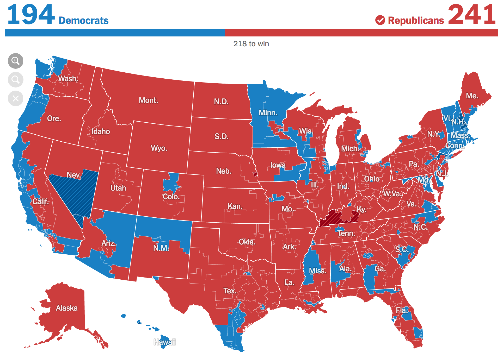
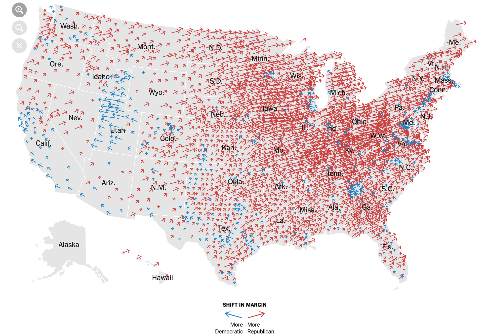
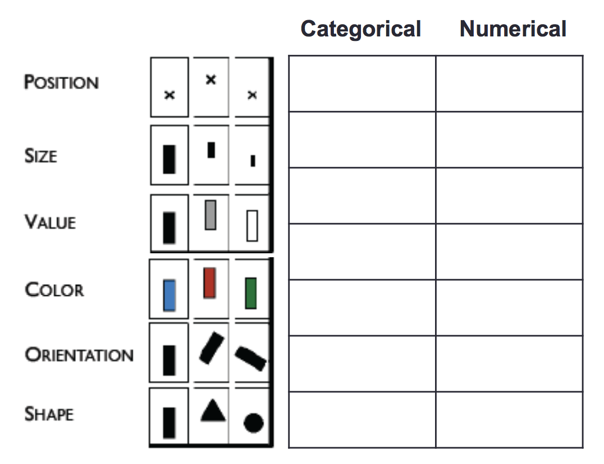

# [fit] Data
# [fit] Graphics

---

# Why do we visualize data?

---

---

---

---

# Visual cues 

---

# Position

Data encoded by **where** the mark is drawn 

 

---

# Size

Data encoded by **how big** the mark is drawn

 

---

# Value

Data encoded by **how dark** the mark is drawn

 

---

# Color

Data encoded by what **hue** is the mark

 

---

# Orientation

Data encoded by how the mark is **rotated**

---

# Shape

Data encoded by the **shape** of the mark

![inline]
(https://espnfivethirtyeight.files.wordpress.com/2016/01/goldenberg-dinos-12.png?quality=90&strip=all&w=2048&ssl=1) 

---

Which visual cues are useful for quantitative (numerical) data? Which are useful for categorical data?

