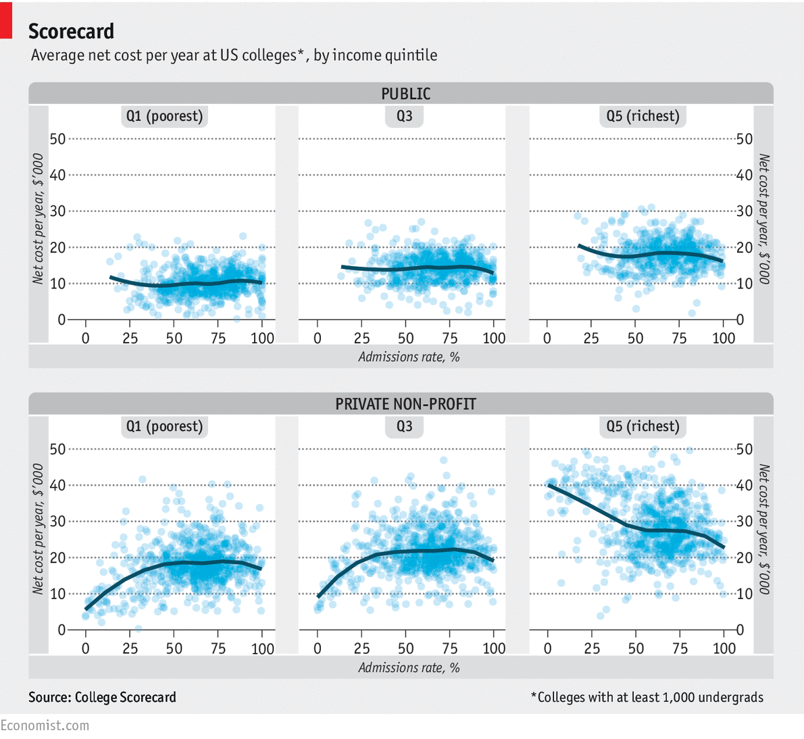

#[fit] Layering
#[fit] Graphics

---

## Reading assignment: Common graphics 

* [Bar chart](http://www.datavizcatalogue.com/methods/bar_chart.html)
* [Boxplot](http://www.datavizcatalogue.com/methods/box_plot.html)
* [Density plot](http://www.datavizcatalogue.com/methods/density_plot.html)
* [Histogram](http://www.datavizcatalogue.com/methods/histogram.html)
* [Line plot](http://www.datavizcatalogue.com/methods/line_graph.html)
* [Scatterplot](http://www.datavizcatalogue.com/methods/scatterplot.html)
* [Stacked bar chart](http://www.datavizcatalogue.com/methods/stacked_bar_graph.html)

---

## Recap: `ggplot2` recipe

---

`library(ggplot2)`

---

`library(ggplot2)`
`ggplot(AmesHousing, aes(x = SalePrice))`
<br>
<br>
<br>


---

`library(ggplot2)`
`ggplot(AmesHousing, aes(x = SalePrice)) +`
`geom_histogram()`
<br>
<br>


---

`library(ggplot2)`
`ggplot(AmesHousing, aes(x = SalePrice)) +`
`geom_histogram() +`
`labs(x = "Sale Price (in $)")`
<br>


---

`library(ggplot2)`
`ggplot(AmesHousing, aes(x = SalePrice)) +`
`geom_histogram() +`
`labs(x = "Sale Price (in $)",`
`title = "Sales Prices of Homes in Ames, IA")`


---

## Layering graphics

---


---

## Data set

#### Source: https://github.com/fivethirtyeight/data

```{}
library(mdsr)
babynames <- make_babynames_dist()
head(babynames)
```

```{}
  year sex      name     n       prop alive_prob count_thousands age_today est_alive_today
1 1900   F      Mary 16707 0.05257295          0          16.707       114               0
2 1900   F     Helen  6343 0.01995991          0           6.343       114               0
3 1900   F      Anna  6114 0.01923930          0           6.114       114               0
4 1900   F  Margaret  5306 0.01669672          0           5.306       114               0
5 1900   F      Ruth  4765 0.01499432          0           4.765       114               0
6 1900   F Elizabeth  4096 0.01288914          0           4.096       114               0

```

---

## Data wrangling

```
library(tidyverse)
joseph <- filter(babynames, name == "Joseph" & sex == "M")
```
```

   year   sex   name     n       prop alive_prob count_thousands age_today est_alive_today
1  1900     M Joseph  3714 0.02290486   0.000000           3.714       114        0.000000
2  1901     M Joseph  2766 0.02392796   0.000025           2.766       113        0.069150
3  1902     M Joseph  3098 0.02333728   0.000050           3.098       112        0.154900
4  1903     M Joseph  3121 0.02413263   0.000075           3.121       111        0.234075
5  1904     M Joseph  3291 0.02376036   0.000100           3.291       110        0.329100
6  1905     M Joseph  3302 0.02305142   0.000125           3.302       109        0.412750
```

---

## Goals

- Bar chart for the number of Joseph's born each year, and estimated to still be alive on Jan. 1, 2014
- Line plot representing the number of Joseph's born each year
- Highlight median age for living Joseph's 
- Add annotations

---

## Your turn

---

**Task:** Recreate this graphic from *The Economist*

- `ScorecardSmallNarrow.csv` available on the course website
- Variables include:
	1. `CONTROL`: public (1) or private (2) institution. 
	2. `ADM_RATE`: admissions rate (%)
	3. `income_group`: income quintile
	4. `net_cost`: avg. net cost for students
- Hint: `geom_smooth` will help





