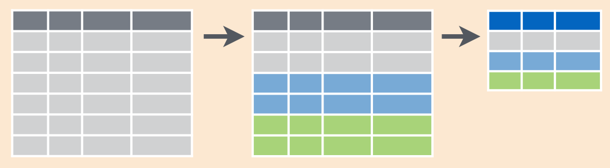

# Set up for today

Load the tidyverse
```{r message=FALSE}
library(tidyverse)
```

As an example, we'll work with different data sets displaying the number of TB cases documented by the WHO
```{r}
table4a # loaded with tidyr package
```


# Recapping tidy data


1. Each variable forms a column
2. Each observation (case) forms a row
3. Each type of observational unit forms a table


# Gathering

```{r results='hide'}
gather(table4a, key = "year", value = "cases", -country)
```


# Spreading 

```{r results='hide'}
spread(table2, key = type, value = count)
```


# Your turn

### Situation:

- During a ten week sensory experiment, 12 individuals were asked to assess taste of french fries on several scales (how potato-y, buttery, grassy, rancid, paint-y do the fries taste?)

- French fries were fried in one of three different oils, and each week individuals had to assess six batches of french fries (all three oils, replicated twice)

### Data:

```{r results='hide'}
french_fries <- read.csv("https://github.com/cmsc205/data/raw/master/frenchfries.csv")
str(french_fries)
```

### Task:

1. Create a side-by-side boxplots of the numeric ratings by scale (potato, buttery, etc.)

2. Create time series plots of the ratings over time for each subject, faceted by the scale. 


# Separate

```{r results='hide'}
separate(table3, rate, into = c("cases", "population"))
```


# Unite

```{r results='hide'}
unite(table5, new, century, year, sep = "")
```


# Why do we care?

- In the `tidyverse` input and outputs of all functions are encouraged to follow the tidy data format

- You might not be able to analyse the data in wide/long format depending on the type of analysis you want to run, or the plot you want to create


# Three kinds of verbs for data wrangling

1. Data verbs
2. Reduction verbs
3. Transformation verbs

There will also be verbs for graphics, loading data, etc., but for wrangling we'll need mainly these three types.

# Example

```{r eval = FALSE}
colleges <- read.csv("data/colleges2015.csv")
colleges <- tbl_df(colleges)
str(colleges)
```

```{r echo=FALSE}
colleges <- read.csv("https://github.com/cmsc205/data/raw/master/colleges2015.csv")
colleges <- tbl_df(colleges)
str(colleges)
```


# Data Verbs

What distinguishes a data verb from a reduction or transformation verb?

* Data verbs create a new data table, from an input data table.

# Some examples of Data Verbs

1. `summarize()`
2. `group_by()`
3. `filter()`
4. `mutate()`
5. `select()`
6. `arrange()`
7. join


# Reduction verbs

Characteristics?

Variable in, a single number out.

Examples?

1. `mean( variable, na.rm=TRUE)`


# Transformation Verbs

As input, they take one or more variable

Examples?

1. `>=`   `age > 20`
2. `==`
2. `age >= 20 | age < 13`
2. `log(price)`


# Filter rows with `filter`

How can we extract all of the schools in Wisconsin?

```{r}
wi <- filter(colleges, state == "WI")
head(wi)
```

# Filter rows with `filter`

What about all Wisconsin schools with fewer than 2,000 students?

```{r}
smallWI <- filter(colleges, state == "WI", undergrads < 2000)
head(smallWI)
```

# Filter rows with `filter`

What about all school with fewer than 2,000 students in either Wisconsin, Minnesota or Iowa?

```{r}
smallWIM <- filter(colleges, state == "WI" | state == "MN" | state == "IA", undergrads < 2000)
head(smallWIM)
```

# Filter rows with `filter`

Alternative syntax

```{r}
smallWIM <- filter(colleges, state %in% c("WI", "MN", "IA"), undergrads < 2000)
head(smallWIM)
```

# Comparison operators

Operator   | Explanation
--------------- |:-----------
`x == y`   | x is exactly equal to y
`x %in% y` | x is an element of y
`x != y`   | x is not equal to y
`x < y`    | x is less than y
`x <= y`   | x is less than or equal to y
`x > y`    | x is greater than y
`x >= y`   | x is greater than or equal to y


# Your turn

- Extract the rows for colleges in the Great Lakes or Plains regions.

- Give this subset a logical name for use later


# Select columns with `select`

If you know exactly what columns you want, then you can `select` them

```{r}
lessCols <- select(colleges, college, city, state, undergrads, cost)
head(lessCols)
```

# Drop columns with `select`

You can also eliminate columns 

```{r}
colleges <- select(colleges, -unitid)
head(colleges)
```

# Rearranging columns with `select`

What is we want to move the `cost` variable next to the college name?

```{r}
colleges <- select(colleges, college, cost, everything())
head(colleges)
```


# Arrange rows with `arrange`

Which is colleges are most expensive?

```{r}
arrange(colleges, cost)
```


# Arrange rows with `arrange`

Which is colleges are least expensive?

```{r}
arrange(colleges, desc(cost))
```


# Your turn

Arrange the subset of schools from the Great Lakes and Plains region to reveal which school has the lowest admissions rate


# Add new variables with `mutate`

What if we want to convert the proportions to percentages?

```{r}
colleges <- mutate(colleges, admissionPct = 100 * admissionRate,
                   FYretentionPct = 100 * FYretention,
                   gradPct = 100 * gradRate)
head(colleges)
```

# Your turn

- Calculate an average ACT score between math and English, and save this as a new ACT column in the colleges data set

- What school(s) has (have) the highest average ACT scores?


# Grouped summaries with `group_by` and `summarize`

How can we find the median cost of attendance in each state?

```{r}
colleges_state <- group_by(colleges, state)
cost_state <- summarize(colleges_state, median.cost = median(cost))
head(cost_state)
```

# What just happened?




# Why do we have so many `NA`s?

```{r}
cost_state <- summarize(colleges_state, median.cost = median(cost, na.rm = TRUE))
head(cost_state)
```

# Grouping by more than one variable

How can we find the median cost of attendance in each state for private/public institutions?

```{r}
colleges_state_type <- group_by(colleges, state, type)
cost_state_type <- summarize(colleges_state_type, median.cost = median(cost))
head(cost_state_type)
```


# Your turn

- Do private schools have lower admissions rates than public schools?

- Do students graduate with less debt from public schools?

- Find the typical difference in average cost between private and public schools by state. Which state has the largest difference? Which state has the smallest difference?