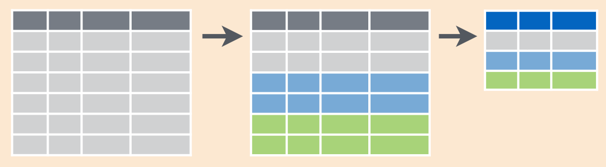

autoscale: true

# Chaining

---

## `nycflights13`

```
library(nycflights13) # load the data

head(flights)
# A tibble: 6 × 19
   year month   day dep_time sched_dep_time dep_delay arr_time sched_arr_time
  <int> <int> <int>    <int>          <int>     <dbl>    <int>          <int>
1  2013     1     1      517            515         2      830            819
2  2013     1     1      533            529         4      850            830
3  2013     1     1      542            540         2      923            850
4  2013     1     1      544            545        -1     1004           1022
5  2013     1     1      554            600        -6      812            837
6  2013     1     1      554            558        -4      740            728
# ... with 11 more variables: arr_delay <dbl>, carrier <chr>, flight <int>,
#   tailnum <chr>, origin <chr>, dest <chr>, air_time <dbl>, distance <dbl>,
#   hour <dbl>, minute <dbl>, time_hour <dttm>
```

---

## Last time...

```
jfk <- filter(flights, origin = "JFK")
summarize(jfk,
          N = n(),
          mean = mean(dep_delay, na.rm = TRUE),
          sd = sd(dep_delay, na.rm = TRUE),
          min = min(dep_delay, na.rm = TRUE),
          Q1 = quantile(dep_delay, probs = 0.25, na.rm = TRUE),
          median = median(dep_delay, na.rm = TRUE),
          Q3 = quantile(dep_delay, probs = 0.75, na.rm = TRUE),
          max = max(dep_delay, na.rm = TRUE))
```

---

## This can get old...

```
small_flights <- select(flights, carrier, origin, dest, month, day, arr_delay, dep_delay)
small_jfk <- filter(small_flights, origin == "JFK")
small_jfk <- mutate(small_jfk, gain = arr_delay - dep_delay)
arrange(small_jfk, desc(gain))

# A tibble: 111,279 × 8
   carrier origin  dest month   day arr_delay dep_delay  gain
     <chr>  <chr> <chr> <int> <int>     <dbl>     <dbl> <dbl>
1       VX    JFK   LAX    11     1       194        -2   196
2       DL    JFK   SFO     7    10       177        16   161
3       MQ    JFK   CMH     7    22       191        41   150
4       B6    JFK   CLT     2    16       214        68   146
5       DL    JFK   SFO     7    10       169        23   146
6       B6    JFK   BUR     7    28       161        15   146
7       B6    JFK   BUF     6    30       142        -2   144
8       UA    JFK   SFO     3    18       140        -3   143
9       DL    JFK   AUS     6    24       138        -3   141
10      B6    JFK   IAD     7     7       132        -9   141
# ... with 111,269 more rows
```

---

## Pipe operator

```
verb(data, arguments)
```
<br>

is equivalent to 

<br>


```
data %>%
	verb(arguments)
```

---

## Pipe operator

```
flights %>%
  select(carrier, origin, dest, month, day, arr_delay, dep_delay) %>%
  filter(origin == "JFK") %>%
  mutate(gain = arr_delay - dep_delay) %>%
  arrange(desc(gain))
```

---

## The pipe improves the readability of your code!

---

## Why do we want reabable code?


---

## Pick a style guide and be consistent!

---

## [http://adv-r.had.co.nz/Style.html](http://adv-r.had.co.nz/Style.html)


---

# `group_by()`

---

## Goal: assess the on-time performance of each airline

---

## `group_by() + summarize()`

```
flights %>%
  group_by(carrier) %>%
  summarize(
    arr = mean(arr_delay, na.rm = TRUE),
    dep = mean(dep_delay, na.rm = TRUE)
  ) %>%
  arrange(desc(arr), desc(dep))
```

---

```
# A tibble: 16 × 3
   carrier        arr       dep
     <chr>      <dbl>     <dbl>
1       F9 21.9207048 20.215543
2       FL 20.1159055 18.726075
3       EV 15.7964311 19.955390
4       YV 15.5569853 18.996330
5       OO 11.9310345 12.586207
6       MQ 10.7747334 10.552041
7       WN  9.6491199 17.711744
8       B6  9.4579733 13.022522
9       9E  7.3796692 16.725769
10      UA  3.5580111 12.106073
11      US  2.1295951  3.782418
12      VX  1.7644644 12.869421
13      DL  1.6443409  9.264505
14      AA  0.3642909  8.586016
15      HA -6.9152047  4.900585
16      AS -9.9308886  5.804775
```

---

## Split-Apply-Combine




---


## Goal: understand daily on-time performance

---

## `group_by() + summarize()`

```
flights %>%
  group_by(year, month, day) %>%
  summarize(
    arr = mean(arr_delay, na.rm = TRUE),
    dep = mean(dep_delay, na.rm = TRUE)
  )
```

---

```
Source: local data frame [365 x 5]
Groups: year, month [?]

    year month   day        arr       dep
   <int> <int> <int>      <dbl>     <dbl>
1   2013     1     1 12.6510229 11.548926
2   2013     1     2 12.6928879 13.858824
3   2013     1     3  5.7333333 10.987832
4   2013     1     4 -1.9328194  8.951595
5   2013     1     5 -1.5258020  5.732218
6   2013     1     6  4.2364294  7.148014
7   2013     1     7 -4.9473118  5.417204
8   2013     1     8 -3.2275785  2.553073
9   2013     1     9 -0.2642777  2.276477
10  2013     1    10 -5.8988159  2.844995
# ... with 355 more rows
```

---

## Your turn

Use the `colleges2015.csv` file from last class to answer the following questions:

1. Which state has the most private schools?
2. Which state has the most private schools with fewer than 3000 students?
3. In which state do students graduate with the least debt? the most debt?
4. Find the typical difference in average cost between private and public schools by state. Which state has the largest difference? Which state has the smallest difference?

