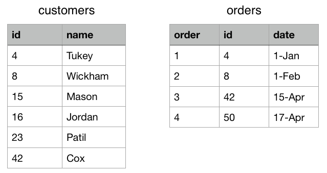

# Joining
# Data Tables

---

## Motivation

An online retailer stores customer data in two places: <br>



---

## Types of joins

1. **Mutating joins** - add new variables to one data frame from matching observations in another
<br>

2. **Filtering joins** - filter observations from one data frame based on whether or not they match an observation in the other

---
  
## Keys

Used to connect two data tables

- **primary key** uniquely identifies an observation in its own table

- **foreign key** uniquely identifies an observation in another table


---

## `inner_join`

An `inner_join` matches pairs of observations when their keys are equal


---

## `inner_join`

```{r}
inner_join(x = orders, y = customers, by = "id")
```


---

## Outer joins

### Keep the rows that appear in a specified table

---


A **left join** keeps all observations in the `x` table

<br>
<br>

A **right join** keeps all observations in the `y` table

<br>
<br>
<br>

A **full join** keeps all observations in both the `x` and `y` tables


---

```{r}
left_join(x = orders, y = customers, by = "id")
```


---

```{r}
right_join(x = orders, y = customers, by = "id")
```


---

```{r}
full_join(x = orders, y = customers, by = "id")
```


---

## Filtering joins

Filtering joins still match observations between two data tables, but do not add additional variables, they **only impact the rows returned.**

1. `semi_join(x, y)` keeps all observations in `x` that have a match in `y`

2. `anti_join(x, y)` drops all observations in `x` that have a match in `y`

---

## `semi_join(x, y)`


Observations will never be duplicated.


---

## `anti_join(x, y)`


---


```{r}
semi_join(x = orders, y = customers, by = "id")
```


---

What if we had an extra order?

```{r}
extra_order <- data.frame(order = 5, id = 42, date = "May-01")
orders2 <- rbind(orders, extra_order)
```


---

How do `semi_join` and `inner_join` differ?

```{r}
semi_join(x = customers, y = orders2, by = "id")
```


---

How do `semi_join` and `inner_join` differ?


```{r}
inner_join(x = customers, y = orders2, by = "id")
```

---

For an `anti_join`, order matters

```{r}
anti_join(x = orders, y = customers, by = "id")
```


---

For an `anti_join`, order matters


```{r}
anti_join(x = customers, y = orders, by = "id")
```


---

## Common complications

---

## Joining by multiple variables, 

You must specify a vector of variable names: 

`by = c("var1", "var2", "var3")`. 

<br>

All three columns must match in both tables.

---

## Use all variables that appear in both tables

Leave the `by` argument blank.

---

## Column names differ between tables

`by = c("left_var" = "right_var")`.

---

# Your Turn


----

## Does payroll differ between the American League and the National League?

- Load the `tidyverse`
- Install and load the `Lahman` R package 
- Look at the `Salaries` and `Teams` data tables
- Devise a way to clearly compare the team payroll between the two leagues over the years