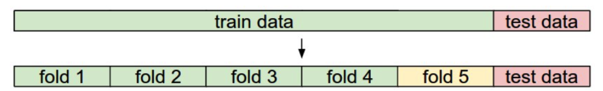

### Setup

Make sure that you have the following packages loaded. If you get an error, remember that you may need to install one of the packages.
```{r setup, message=FALSE}
library(tidyverse)
library(viridis)
library(class)
library(purrr)
```

I wrote the below `normalize` function to rescale numeric columns in a data frame so that they have mean 0 and standard deviation 1.

```{r}
# Function to normalize the numeric columns of a data frame
# requires the purrr package to be installed
normalize <- function(df) {
  num_cols <- df %>%
    select_if(is.numeric) %>%
    purrr::map_df(function(x) as.numeric(scale(x)))
  other_cols <- df %>%
    select_if(function(x) !is.numeric(x))
  cbind(num_cols, other_cols)
}
```

* * *

## Introduction

Many data-scientific projects involve making predictions about future observations from past data. While there are multiple types of predictions problems, today we will focus on **classification**: predicting what class (group) a future observation belongs to. Common examples of classification problems include:

* Will a loan applicant default?
* Is this a fradulent credit card purchase?
* Will an admitted student attend Lawrence in the fall?
* Who are likely voters going to vote for?

The simplest classification tasks require predictions that are in a yes/no format. These are called **binary classifications.** More complicated classification tasks have more than two possible classes, and are called **multiclass classifications**.

In the classification setting there are two types of variables: **attributes** and **classes**. 

* The **class** of an observation is what we're trying to predict, but we'll know the class of the observations in our **training data set**.
* The **attributes** are the variables used in an effort to predict the class.


## Example: Chronic kidney disease

The best way to understand classification is to work through examples. To begin, we'll consider a data set that was collected to help doctors diagnose chronic kidney disease (CKD) and is hosted on the [UCI Machine Learning Repository](https://archive.ics.uci.edu/ml/datasets/Chronic_Kidney_Disease#).

The data set is comprised of the test results from 158 patients. Below is a list of all the variables included.

Variable | Description
-------- | -------------
`age`	|	age	(years)
`bp`	|	blood pressure (mm/Hg)
`sg`	|	specific gravity (1.005, 1.010, 1.015, 1.020, 1.025)
`al`	| albumin (0, 1, 2, 3, 4, 5) 
`su`	|	sugar (0, 1, 2, 3, 4, 5) 
`rbc`	|	red blood cells (normal, abnormal)
`pc`	|	pus cell (normal, abnormal)
`pcc`	|	pus cell clumps (present, notpresent)
`ba`	|	bacteria (present, notpresent)
`bgr`	|	blood glucose random (mgs/dl)
`bu`	|	blood urea (mgs/dl)
`sc`	|	serum creatinine (mgs/dl)
`sod`	|	sodium (mEq/L)
`pot`	|	potassium (mEq/L)
`hemo`	|	hemoglobin (gms)
`pcv`	|	packed cell volume 
`wbcc`	|	white blood cell count (cells/cumm)
`rbcc`	|	red blood cell count (millions/cmm)
`htn`	|	hypertension (yes, no)
`dm`	|	diabetes mellitus (yes, no)
`cad`	|	coronary artery disease (yes, no)
`appet`	|	appetite (good, poor)
`pe`	|	pedal edema (yes, no)
`ane`	|	anemia (yes, no)
`class`	|	class (ckd, notckd)


Load the data using the following code (assuming that you have the data set in your data folder, otherwise, you can paste the url in place of the file name):

```{r}
ckd <- read.csv("data/ckd.csv")
head(ckd)
```

### Data processing

The quantitative variables all have different scales. We're going to want to make comparisons and estimate distances, often by eye, so let's select just a few of the variables and work in standard units. This way we won't have to worry about the scale of each of the different variables.

```{r}
ckd_norm <- normalize(ckd) %>%
  select(hemo, bgr, wbcc, class)

head(ckd_norm)
```

Let's look at two columns in particular: the hemoglobin level (in the patient's blood), and the blood glucose level (at a random time in the day; without fasting specially for the blood test).

```{r}
ggplot(data = ckd_norm, aes(x = hemo, y = bgr, fill = class)) +
  geom_point(color = "black", pch = 21) +
  labs(x = "Hemoglobin", y = "Glucose") +
  scale_fill_viridis(discrete = TRUE) +
  theme_minimal()
```


#### Goal

Develop a classifier will allow us to take hemoglobin and glucose measurements and predict whether the patient has chronic kidney disease (CKD) or not.

* * * 

## Nearest neighbor (1NN) classifier

A simple algorithm that can be used to classify data is **nearest neighbor classification.** Here's the idea:

1. Take a patient's hemoglobin and glucose numbers and find the *closest* point to that ordered pair on the scatterplot.
2. Predict that the patient has the same CKD status as that closest point.

```{r echo=FALSE}
ggplot(data = ckd_norm) +
  geom_point(aes(x = hemo, y = bgr, fill = class), color = "black", pch = 21) +
  geom_point(aes(x = 0, y = 1.5), color = "red") +
  labs(x = "Hemoglobin", y = "Glucose") +
  scale_fill_viridis(discrete = TRUE) +
  theme_minimal()
```

### Visualizing the classifier

Sometimes a helpful way to visualize a classifier is to map out the kinds of attributes where the classifier would predict 'CKD', and the kinds where it would predict 'not CKD'. We end up with some boundary between the two, where points on one side of the boundary will be classified 'CKD' and points on the other side will be classified 'not CKD'. This boundary is called the **decision boundary**.

Here are hundreds of new unclassified points, all in gray.

```{r message=FALSE, echo=FALSE}
# Many simulated values to classify
grid_pts <- expand.grid(hemo = seq(-2, 2, length.out = 40), bgr = seq(-2, 2, length.out = 40))

ggplot(data = ckd_norm) +
  geom_point(data = grid_pts, aes(x = hemo, y = bgr), alpha = 0.3) +
  geom_point(aes(x = hemo, y = bgr, fill = class), color = "black", pch = 21) +
  labs(x = "Hemoglobin", y = "Glucose") +
  scale_fill_viridis(discrete = TRUE) +
  lims(x = c(-2, 2), y = c(-2, 2)) +
  theme_minimal()
```

For each gray point, we must find the closest point in the training set; we must then change the color of the gray point to become the color of the nearest neighbor.

The below graph shows which points will get classified as 'CKD' (all the purple ones), and which as 'not CKD' (all the yellow ones).

```{r echo=FALSE}
# Illustrating the decision boundary
knn_preds <- knn(train = ckd_norm[,1:2], test = grid_pts, cl = ckd_norm[["class"]], k = 1)

knn_df <- data.frame(grid_pts, class = knn_preds)

ggplot(data = ckd_norm) +
  geom_point(data = knn_df, aes(x = hemo, y = bgr, color = class), alpha = 0.4) +
  geom_point(aes(x = hemo, y = bgr, fill = class), color = "black", pch = 21) +
  labs(x = "Hemoglobin", y = "Glucose") +
  scale_color_viridis(discrete = TRUE) +
  scale_fill_viridis(discrete = TRUE) +
  lims(x = c(-2, 2), y = c(-2, 2)) +
  theme_minimal()
```


## Another example

In most applications, we don't start with a "clean" separation of classes. For example, let's look at a patient's white blood cell count and their blood glucose level.

```{r echo=FALSE}
ggplot(data = ckd_norm, aes(x = wbcc, y = bgr, fill = class)) +
  geom_point(color = "black", pch = 21, alpha = 0.7) +
  labs(x = "White blood cell count", y = "Glucose") +
  scale_fill_viridis(discrete = TRUE) +
  theme_minimal()
```

#### Goal

Develop a classifier will allow us to take white blood cell count and glucose measurements and predict whether the patient has chronic kidney disease (CKD) or not.

#### Question

Is the nearest neighbor classifier reasonable here? What would the decision boundary look like? What do you think of this classifier?

## k-nearest neighbor (KNN) classifier

Instead of using only the closest observation to predict a new patient's CKD status, we can use the closest $k = 3$ observations and use the majority value as our prediction.

Let's see how this works on our example.

```{r echo=FALSE}
grid_pts <- expand.grid(bgr = seq(-2, 6, length.out = 40), wbcc = seq(-2, 6, length.out = 40))

knn_preds <- knn(train = ckd_norm[,c(2,3)], test = grid_pts, cl = ckd_norm[["class"]], k = 3)

knn_df <- data.frame(grid_pts, class = knn_preds)

knn_decisions <- 
  ggplot(data = knn_df) +
  geom_point(aes(x = wbcc, y = bgr, color = class), alpha = 0.4) +
  geom_point(data = ckd_norm, aes(x = wbcc, y = bgr, fill = class), color = "black", pch = 21, alpha = 0.7) +
  labs(x = "White Blood Cell Count", y = "Glucose") +
  scale_color_viridis(discrete = TRUE) +
  scale_fill_viridis(discrete = TRUE)
knn_decisions + theme_minimal()
```


## Assessing classifiers

Often, we need to decide between competing classifiers (e.g. 3-NN vs. 5-NN) or simply want to understand how well a classifier is performing. To do this, *we need to assess the accuracy of the classifier's predictions.*

#### Approach

We can *test* our classifier using part of the data set:

* Try the classifier on some patients whose true classes are known. 

* Compute the proportion of the time our classifier was correct to estimate the proportion of all new patients whose class our classifier will accurately predict.

#### Question

Why don't we simply compare the prediction and true class for all of the observations in our data set?


So we will have **three groups of individuals:**

* a **training set** on which we can do any amount of exploration to build our classifier;
* a separate **testing set** on which to try out our classifier and see what fraction of times it classifies correctly;
* the underlying **population** of individuals for whom we don't know the true classes; the hope is that our classifier will succeed about as well for these individuals as it did for our testing set.


### Generating training and testing data sets

We can use the `sample` function to easily select the row of our data frame to use as the training set:

```{r}
train_index <- sample(nrow(ckd_norm), size = 79) # half of rows
ckd_train <- ckd_norm[train_index,]
ckd_test <- ckd_norm[-train_index,]
```

Note: Each time we run the above code chunk the training set will change. To avoid this, we can specify the state for the random number generator, allowing us to always obtain the same sample. To do this, simply add the below line of code (you can change the number in the parentheses) to the above code chunk.

```{r}
set.seed(2152017)
```


### Implementing KNN in R

The `knn` function in the `class` package implements the k-nearest neighbor classifier in R.

As a first example, let's run the previous classifier for CKD using white blood cell count and glucose as attributes.

1. Randomly split your data set into a training and a test data set. (This is done above.)

2. Create data frames with the attributes for both the training and the test data sets. 

```{r}
train_attr <- ckd_train %>% 
  select(wbcc, bgr)

test_attr <- ckd_test %>%
  select(wbcc, bgr)
```

3. Create class vectors for both the training and the test data sets. 

```{r}
train_class <- ckd_train$class
test_class <- ckd_test$class
```

4. Create the classifier using the `knn` function:

```{r}
nn3_class <- knn(train = train_attr, test = test_attr, cl = train_class, k = 3)
```


Argument | Explanation
-------- | ------------
`train` | matrix or data frame of training set cases
`test` | matrix or data frame of test set cases
`cl` | vector of true classifications of training set
`k` | number of neighbors considered

What does `knn` return?

```{r}
nn3_class
```


### Assessing accuracy

To assess the accuracy of our classifier, we compare our predicted classes with the actual classes in our test set. This is often done using a table called a **confusion matrix**.

```{r}
cmat <- table(prediction = nn3_class, truth = test_class)
cmat
```

Using the confusion matrix we can easily calculate the proportion of correctly identified cases, which we call the **accuracy**:

```{r}
sum(diag(cmat)) / sum(cmat)
```

* * * 

## Selecting k

There is no analytical formula available to calculate the best number of neighbors, so we need to figure out an approach to choose the best value.

One idea is to fit competing classifiers (e.g. k = 1, 3, 5, 7, and 9) to the training data and choose the classifier with the highest accuracy on the test set. *This is not a good idea. (It's like using a point estimate rather than an interval estimate.)*

**Cross-validation** is a better idea.




#### Overview: 

* <span style="color:green">Training data</span>: train classifier
* <span style="color:gold">Validation data</span>: estimate k (the tuning parameter)
* <span style="color:red">Test data</span>: measure performance


#### Procedure:

1. Iterate over choice of validation fold
2. For all parameter values:
    a. Train with training data
    b. Validate with validation data
3. Average the parameters with best performance on validation data

The test data is NOT used to determine the parameters, or else you won't know how your classifier could perform on unseen data!


#### Implementation in R

To begin, we'll create training and testing data sets. Here, I'll use about 30% of the observations in my test set.

```{r}
train_index <- sample(nrow(ckd_norm), size = ceiling(.7 * nrow(ckd_norm)))

ckd_train <- ckd_norm[train_index,] 
ckd_test <- ckd_norm[-train_index,]

ckd_train <- select(ckd_train, -hemo)
ckd_test <- select(ckd_test, -hemo)
```

For this example, let's perform 5-fold cross validation (as illustrated in the above graphic).

```{r}
# Function to create confusion matrix
confusion_mat <- function(class, prediction) {
  table(prediction = prediction, truth = class)
}

# Function to calculate accuracy from confusion matrix
accuracy <- function(x) {
  sum(diag(x)) / sum(x)
}

# Function to run k-fold cross validation for KNN
# df is the training data frame
# cl is a string indicating the column specifying the class
# k is the number of neighbors
# n_fold is the number of folds
knn_cv <- function(df, cl, k = c(1, 3, 5, 7, 9), n_folds = 5) {

# generate array containing fold-number for each sample (row)
folds <- rep_len(1:n_folds, nrow(ckd_train))
folds <- sample(folds)

results <- vector("list", length(k))
results <- lapply(results, function(x) numeric(n_folds))

attr_names <- setdiff(colnames(df), cl)

# actual cross validation
for(i in 1:n_folds) {
    # actual split of the data
    fold <- which(folds == i)
    train <- df[-fold,]
    test <- df[fold,]

    train_attr <- train[attr_names]
    test_attr  <- test[attr_names]
    train_cl <- train[[cl]]
    test_cl <- test[[cl]]

    # train and test classifier
    for(j in seq_along(k)) {
      fit <- knn(train_attr, test_attr, cl = train[[cl]], k = k[j])
      results[[j]][i] <- accuracy(confusion_mat(class = test_cl, prediction = fit))
    }
}

data.frame(k = k, accuracy = sapply(results, FUN = mean))

}
```

```{r}
knn_cv(df = ckd_train, cl = "class", k = c(1, 3, 5, 7, 9), n_folds = 5)
```

Once you have decided on your value of k, fit the classifier to all of the training set and assess the accuarcy on new data using the test set.

```{r}
ckd_train_attr <- select(ckd_train, -class)
ckd_test_attr <- select(ckd_test, -class)
nn5_class <- knn(train = ckd_train_attr, test = ckd_test_attr, cl = ckd_train[["class"]], k = 5)

cmat <- confusion_mat(ckd_test[["class"]], prediction = nn5_class)
cmat

accuracy(cmat)
```


#### Alternative implementation

An alternative way to implement this in R is to use the `caret` package.

```{r}
library(caret)
ctrl <- trainControl(method = "cv", number = 5) 
knn_fit <- train(class ~ ., data = ckd_train, method = "knn", tuneGrid = data.frame(k = seq(1, 9, by = 2)))
knn_fit
```

Now, let's get our accuracy from the test set:

```{r}
knn_predict <- predict(knn_fit, newdata = ckd_test)
confusionMatrix(knn_predict, ckd_test$class)
```


* * * 

#### Acknowledgements

This set of notes was adapted from David Wagner's [chapter](https://www.inferentialthinking.com/chapters/15/classification.html) in [Computational and Inferential Thinking: The Foundations of Data Science](https://www.gitbook.com/book/ds8/textbook/details).